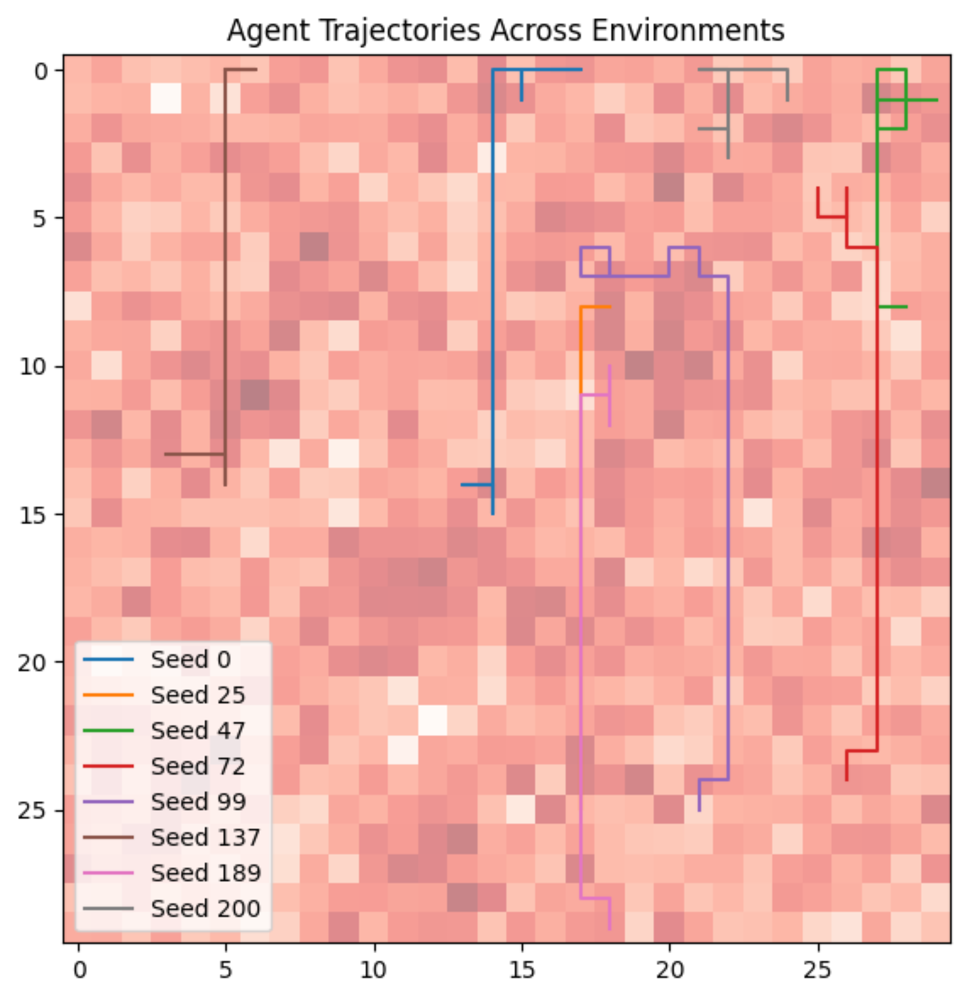
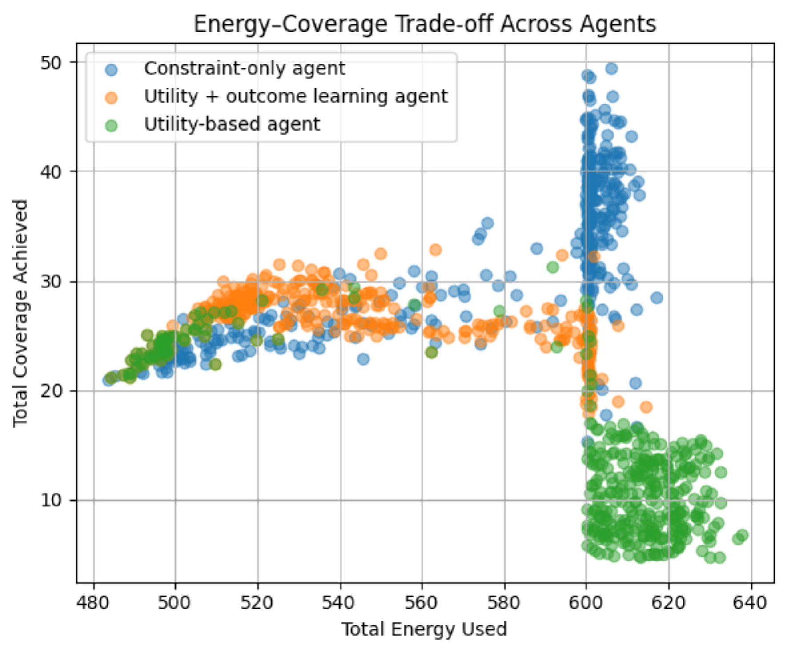
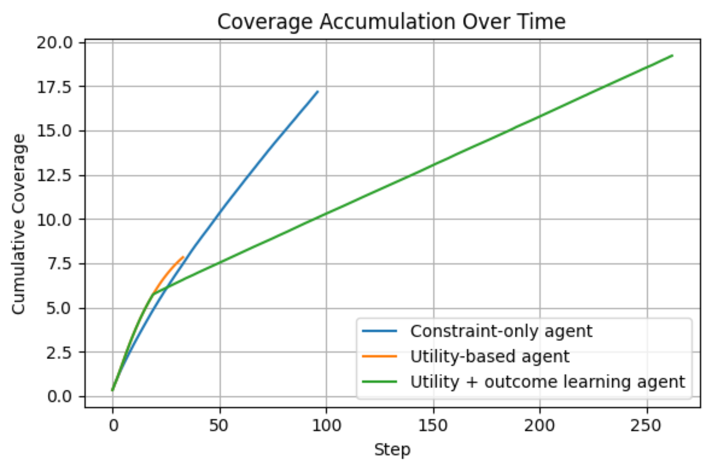
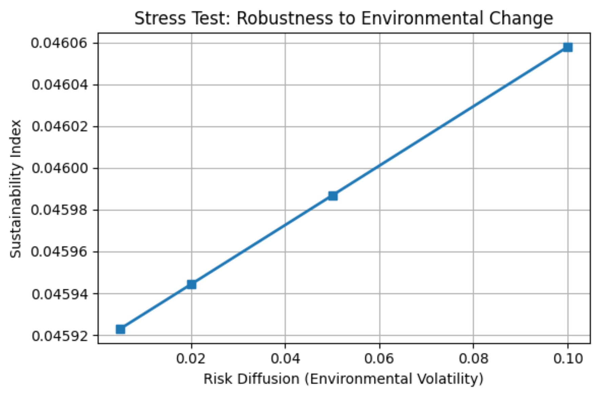

# Energy-Aware Agentic Geo-AI Framework

Lightweight decision-centric Geo-AI framework for energy-aware environmental monitoring using utility-based reasoning and online outcome learning.

---

## Overview

This repository contains the implementation and experimental evaluation of a lightweight Geo-AI framework designed for energy-aware environmental monitoring under spatial and operational constraints.

The framework models a simulated geo-environment containing:
- dynamic environmental risk,
- terrain-dependent energy cost,
- monitoring coverage dynamics,
- partial observability.

An autonomous monitoring agent operates inside this environment using:
- rule-based feasibility constraints,
- utility-based decision reasoning,
- lightweight online outcome learning.

Unlike end-to-end policy learning approaches, this framework emphasizes:
- interpretability,
- explicit decision-making,
- computational simplicity,
- transparent trade-offs between risk, energy, and monitoring coverage.

---

## Motivation

Environmental monitoring systems often operate under limited energy availability and uncertain environmental conditions.

Many existing AI-based approaches rely heavily on:
- large-scale training,
- black-box policies,
- computationally expensive optimization.

This project explores an alternative approach based on:
- explicit utility reasoning,
- lightweight learning,
- interpretable agent behavior,
- simulation-driven experimentation.

The goal is to study how autonomous monitoring agents can balance:
- environmental risk,
- energy efficiency,
- spatial monitoring coverage,
while remaining computationally lightweight and explainable.

---

## Framework Components

The framework consists of four main components:

| Component | Description |
|---|---|
| Geo-Environment | Simulated spatial environment with risk, terrain cost, and coverage dynamics |
| Agent Architecture | Autonomous decision-making agent operating under partial observability |
| Utility-Based Reasoning | Explicit trade-off balancing between risk, energy, and coverage |
| Outcome Learning | Lightweight online learning used for outcome estimation |

---

## Repository Structure

```text
energy-aware-agentic-geoai-framework/
│
├── docs/               # Methodology and framework explanations
├── figures/            # Paper figures and visual results
├── paper_info/         # Abstract, citation, and publication disclaimer
├── presentation/       # Conference presentation material
├── results/            # Processed experiment outputs
├── src/                # Core implementation files
│
├── README.md
├── LICENSE
└── requirements.txt
```

---

## Documentation

### Framework Documentation
- [Environment Design](docs/environment_design.md)
- [Utility Reasoning](docs/utility_reasoning.md)
- [Experiments](docs/experiments.md)
- [Interpretation](docs/interpretation.md)

### Source Code
- [Source Code Overview](src/README.md)

### Experimental Results
- [Results Overview](results/README.md)

### Figures
- [Figure Descriptions](figures/README.md)

---

## Geo-Environment Design

The monitoring region is represented as a two-dimensional spatial grid.

Each cell contains:
- environmental risk,
- terrain-dependent movement cost,
- monitoring coverage information.

The environment also includes:
- dynamic risk diffusion,
- coverage decay,
- local neighborhood perception.

### Coverage Decay

Coverage decay simulates environmental information becoming outdated over time.

If an area is not revisited, its monitoring quality gradually decreases, encouraging sustained environmental monitoring instead of one-time exploration.

### Risk Diffusion

Environmental risk changes dynamically during simulation through stochastic diffusion, allowing the environment to evolve over time and creating uncertainty during decision-making.

---

## Agent Design

The monitoring agent operates under partial observability.

At each time step, the agent:
1. observes the local environment,
2. filters unsafe actions,
3. predicts action outcomes,
4. computes utility values,
5. selects the most desirable action.

The framework separates:
- feasibility constraints,
- utility reasoning,
- learning.

This preserves interpretability and explicit decision-making throughout the simulation process.

---

## Utility-Based Reasoning

The agent evaluates candidate actions using a utility function that balances:
- coverage improvement,
- environmental risk,
- energy consumption.

Higher utility actions are preferred during decision-making.

The utility function enables:
- transparent trade-offs,
- interpretable decisions,
- explicit operational priorities.

Unlike black-box policies, the decision process remains understandable and controllable.

---

## Experimental Setup

Three agent configurations were evaluated:

| Agent Type | Description |
|---|---|
| Constraint-only agent | Uses only rule-based feasibility constraints |
| Utility-based agent | Uses utility reasoning without learning |
| Utility + outcome learning agent | Combines utility reasoning with lightweight online learning |

Experiments evaluate:
- energy consumption,
- monitoring coverage,
- sustainability,
- robustness to environmental volatility.

---

# Key Results

## Agent Trajectories Across Environments



The trajectories demonstrate how agent behavior changes across independently generated environments with varying spatial risk structures.

---

## Energy–Coverage Trade-off



The learning-augmented agent achieves a more balanced trade-off between monitoring coverage and energy consumption compared to the baseline agents.

---

## Aggregate Performance Summary

| Agent | Energy Used | Coverage | Sustainability |
|---|---|---|---|
| Constraint-only agent | 575.90 | 32.46 | 0.056 |
| Utility-based agent | 594.26 | 13.18 | 0.023 |
| Utility + outcome learning agent | 540.18 | 26.39 | 0.049 |

---

## Coverage Accumulation Over Time



The learning-augmented agent maintains more stable long-term coverage accumulation during monitoring.

---

## Robustness to Environmental Volatility



The framework maintains stable sustainability under increasing environmental volatility.

---

## Running the Framework

Install dependencies:

```bash
pip install -r requirements.txt
```

Run experiments from the source directory.

---

## Research Contribution

This project demonstrates that:
- lightweight simulation,
- explicit utility reasoning,
- interpretable decision-making,
- lightweight online learning,

can support effective environmental monitoring without relying on computationally expensive end-to-end policy learning.

---

## Conference Presentation

The work was presented at:

**International Conference on Geo-AI for Environment Monitoring and Sustainability (IC-GEMS'26)**

---

## Citation

Citation information is available inside:

```text
paper_info/citation.txt
```

---

## Disclaimer

This repository contains the research implementation and supporting experimental material associated with the project.

The full manuscript/book chapter is not included in this repository.

---

## License

This project is licensed under the Apache License 2.0.
